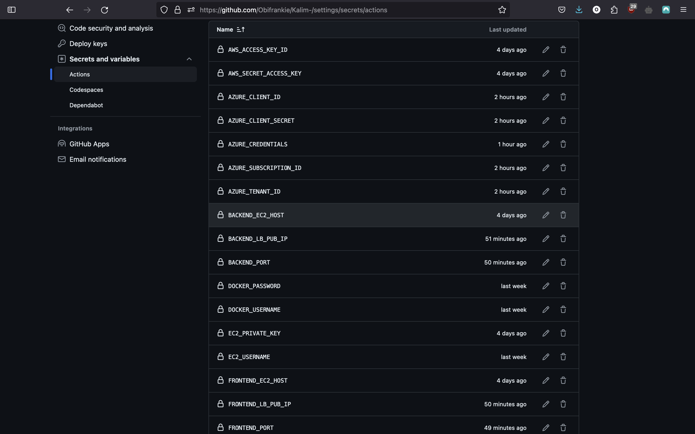

To get this get this repo and the content of this repo. Please fork this repo

# PLEASE READ THROUGH THE WHOLEPAGE BEFORE YOU START DEPLOYING THE SOLUTION

#### PLEASE NOTE AS A FIRST STEP I ADVISE THAT YOU FIRST UPDATE YOU DESIRED VALUES IN THE BACKEND.TF THIS IS SO TERRAFORM CAN USE A REMOTE BACKEND FOR THE FILE. THE VALUES THAT WOULD BE PROVIDED ARE SENSITIVE VALUES SO I WILL NOT HARD CODE IT IN THE SCRIPT.


 PLEASE MAKE SURE YOU HAVE PROPERLY CONFIGURED BACKEND.TF in the Azure-infra directory WITH YOUR DESIRED VALUES.
 TO GET TO BACKEND.TF for the Azure-infra CLICK ON THE Azure-infra FOLDER THEN YOU WOULD SEE BACKEND.TF THEN UPDATE IT WITH YOUR DESIRED CONFIGURATIONS.

#### AGAIN TO GET TO BACKEND.TF THIS IS THE FOLDER STRUCTURE
Azure-infra --> BACKEND.TF

AFTER UPDATING Azure-infra/BACKEND.TF PLEASE CONTINUE WITH THE REST OF THE STEPS IN THE README

## Familiarise With The Folder structure
This is the a brief description of the necessary files and folders required to succesfully deploy this application

**Backend**
This folder in the root of the code base houses the dockerfile to build backed images. It also has a readme.md so one can use to quickly write to it and trigger a release

**frontend**
This folder in the root of the code base houses the dockerfile to build backed images. It also has a readme.md so one can use to quickly write to it and trigger a release

**Aws-infra**
I also wrote a terraform script to deploy to Aws previously and I was aksed to change it to Azure. I decided not to delete the AWS terraform script and moved it into a seperate folder 

**Azure-infra**
This folder contains the terraform file to build the required infrastructure in Azure 

**.github/workflows**
This folder contains the yaml configurations for the github actions pipeline. 

**screenshots**
Contains image used for this readme.md


### Takeaways 

Here are some key take aways I like to point out before continuing with the process I took to achieve this deployment 

**FRONTEND**
- The javascript package.json file is missing the build section which tells node how to properly build the package without this section, node does not properly build the package and I did not add this section myself because for one I don't know if this was by design, by choice or by ommission. So I have disabled the ```RUN npm run build``` and the ```COPY --from=build /app/build /usr/share/nginx/html``` by commenting them out in the frontend/Dockerfile please after the package.json is properly formatted and the build is added by the author please uncomment or remove the comment on the ```RUN npm run build``` and the ```COPY --from=build /app/build /usr/share/nginx/html``` this would make the Docker Image build to conclusion now. The frontend is accessible at the public ip of the frontend at port 80 **{frontend-lb-Pub-ip}:80**

**BACKEND**
- The code base did not come with a .jar file, I dont also now if this was done purposely or by ommision but I had to build the code base myself using the ./mvnw clean verify command. This would have been an issue for me if i did not have a system that had a java environment but I was lucky enough to have a java environment. The Dockerfile for the backend is complete and the backend is accessible at the public ip of the backend at port 8080 **{backend-lb-Pub-ip}:8080**

To achieve my desired architecture we had 2 major options that suits this deployment use case 

- Use an AKS cluster on Azure (Or any managed kubernetes offering on other major cloud providers)

- Or use a scaleset with load balancing 

I want for the second option which is use a scaleset with load balancing for two major reasons 

- For simplicity sake, I prefer to keep things as easy possible and avoid over-complicating things when they should not be

- Cost since this is just a test deployment. I dont want to incure the costs that is involved in creating a Kubernetes Cluster 


## AZURE

The Azure resources used for this deployment is as follows 

- scale set to automate the horizontal and vertical scaling of our vms
- load balancers to manage the network traffic coming into our scalesetss
- A Virtual Network to manage all netwrok related requirements 
- Subnets to fragment the network
- NSG to manage traffic to the instances behind the scale set


## Pipeline

We are using github actions for the deployment CI/CD. To avoid over complicationg the setup I made both the frontend and the backend have a public ip address this is bad practise but in the current use case I would make the backend have a public Ip address so that we can easily deply the docker images to the backend as well.

Due to the fact that we are using a load balancer to manage the traffic that is getting to out instances behind the scale set we cannot SSH directly to those servers using port 22. We have to set up and configure an Inbound NAT rule for the load balancer this would allow the load balancer monitor all the requests from a particular port on creation and forward every request on that port to port 22 on the instance which is the SSH port for instances. The load balancer is able to perform this action just like how it handles HTTP requests on a particular port.

To manually try and SSH into the server from your local environment or computer using the load balancer please run this code ```ssh -i <part to private key> -p <frontendport/range> <username>@<frontend-lb-pip or backend-lp-pip>```

***ssh*** is the command used to ssh

***i*** the i flag is used to specify the part to a private key to use to ssh to the server 

***part to private key***  the part to the private key

***p*** this flag is used to specify a port 

***frontendport/range*** this is the port on the load balancer

***username*** this is the user we want to use to SSH. This is a user already on server most cases it is adminuser

***frontend-lb-pip or backend-lp-pip*** this is the public ip address of either the backend or frontend load balancer depending on which instance you want to SSH too


## Order of Pipeline deployment
1) Azure-create-infra.yml
2) Azure-deploy-backend.yml
3) Azure-deploy-frontend.yml
4) Azure-destroy-infra.yml **Only run this pipeline when you want to destroy the wwhole infrastructure**


**Azure-create-infra.yml** This pipeline deploys the Infrastructure to Azure. This pipeline watches and monitores the Azure-infra/ folder and automatically deploys based on changes to that folder but I disabled the automatic deploy because I felt this might led to some issues down the line especially with this being the main branch. So to deploy changes or create an infrastructure you must tigger the Pipeline manually. You can as well re-enable automatic deploy by removing the comments on the push on branch in the  Azure-create-infra.yml.


**Azure-deploy-backend.yml** This pipeline automatically runs whenever there is a change in the Backend/ folder this is where the dockerfile to deploy the backend is stored. So whenever there is a change in this follder it would trigger the deployment of a new image. I added a readme.md file in this directory so you can write anything into that readme.md and it would automatically trigger a release of a new backend image 


**Azure-deploy-frontend.yml** this pipeline automatically runs whenever there is a change in the frontend/ folder this is where the dockerfile to deploy the backend is stored. So whenever there is a change in this follder it would trigger the deployment of a new image. I added a readme.md file in this directory so you can write anything into that readme.md and it would automatically trigger a release of a new frontend image 


**Azure-destroy-infra.yml** this pipeline only destroys the whole infrastructure. It uses a manual trigger so you would have to trigger it manually and it would destroy the whole infrastructure.


# DEPLOY

### NOTE STEPS TO DEPLOY THE INFRASTRUCTURE AND APPLICATION WILL BE EXPLAINED FURTHER BELOW

 #### Update Azure-infra/backend.tf with you desired parameters
 We need to properly configure backend.tf for terraform can use a remote backend. We do this update in the Azure-infra/backend.tf below are the required parameters to update in the Azure-infra/backend.tf.

The following values below should be manual created in the Azure portal then the we can use it in the backend.tf to create the remote bucket. The folllowing values should be created in the Azure portal except **key**. Terraform would upload this by itself on initialisation of the backend


- **resource_group_name** this is the name of the resorces group you want to store your terraform state file. It does not have to be the same resources group the project is using (I advice you use a different resource group so the lifecycle of the terraform state with not be the same as the lifecycle of the project)

- **storage_account_name** this is the name you want to give the storage account 

- **container_name** this is the name of the container 

- **key** tis is the name of the terraform state file itself the default name most organization use is *terraform.tfstate*

***You would need to create the resource group, storage account, bucket manually on the cloud then use the values from the cloud and update the Azure-infra/backend.tf file***

#### Create private key 
To keep the infrastructue as secure as we can. I am not going to attache my own public key to the repo. It is best we create a new public key when deploying. Below are the steps to create a public key and use it in the code 

- First please pull the repo 
- change in to the Azure/infra directory in the repo 
- run ```ssh-keygen -t rsa -b 4096 -f vm``` i suggest not to change the file name and run the code as is so you wont bother with updating the admin-ssh in scale set resource block

The command ablove would create public and private keys called vm.pub and vm respectfully 

#### Sign into Azure 

We are also going to setup our pipeline to authenticate into Azure but jsut to be allow for flexibility. We are also going to login into Azure in our local environment. We are doing this because for most Azure free tier and student accounts we cannot properly configure a pipeline to authenticate to it, this is because they cannot create service principals on the command line. And this is because this type of accounts don't have proper priviledges to Microsoft Entra ID for their tenants.

So to setup your local environment to authenticate against your tenant.
- run ```az login```
  
- run ``` az account show``` to confirm the account 


#### Configure a service principal for the pipeline

If you happen to have full access to Microsoft Entra ID we are going to create a service principal. We are doing this so we can get our pipelines to be able to create and destroy infrastructure on our behalf. ***If you dont have full access to Microsoft Entra ID no problem just pull the repo and run the terraform code(terraform init. terraform plan, terraform apply)from your local environment***

Below are the steps to configure the service principal for the pipelines 

- run ```az login```
  
- run ```az ad sp create-for-rbac --name "myServicePrincipal" --role contributor --scopes /subscriptions/<your-subscription-id> --sdk-auth```

please update the following values in the command above with your own desired values 
***myServicePrincipal*** this is the name you want to give the service principal  


***<your-subscription-id>*** this is the subscription id of the tenant you want to this principal to authenticate against. You can view your subscriptionID bu running ```az account show```. This would produce a json output the tenant ID is the value for the ID key.

- Copy the output json of this command and store it we would need it to create our secret values in github

 #### Configure Pipeline Secret Values 
We are going to group the secret values into two different categories 
- Secrets you should setup pre deployment
- Secret you should setup post Azure-create-infra.yml deployment

This is because the secret we need to setup posy Azure-create-infra.yml are values we can only findout after the creation of the infrastructure 

##### Secrets you should setup pre deployment


- Navigate to Settings of this current repo -> Secrets and variables -> Actions.
- Click on New repository secret and add the following secrets:
- Create the AZURE_CREDENTIALS secret ***Copy the whole output json from the ```az ad sp create-for-rbac --name "myServicePrincipal" --role contributor --scopes /subscriptions/<your-subscription-id> --sdk-auth``` command and use it to create this secret
- Create the AZURE_CLIENT_ID secret ***Your Service Principal’s clientId***
- Create the AZURE_CLIENT_SECRET secret ***Your Service Principal’s clientSecret***
- Create the AZURE_SUBSCRIPTION_ID secret ***Your Azure Subscription ID***
- Create the AZURE_TENANT_ID secret ***Your Azure Tenant ID***
- Create the DOCKER_PASSWORD secret ***Your passowrd for your docker hub***
- Create the DOCKER_USERNAME secret ***Your username for docker hub***
- Create the TAG secret ***this is the value you want to use and tag your images you can use latest as a default value**
- Create the VM_PRIVATE_KEY secret ***This is the content of the public key in our case the public key is named vm.pub(assuming you left the default values in the Create private key section). Copy the contents of vm.pub and use it to creeate the secret***
- Create the VM_USERNAME secret ***This is the username that we setup for the virtual machines in our case it is adminuser(assuming nothing was changed in the terraform code)***

You can only run the Azure-create-infra.yml succesfully at this stage because you need the output of the creation to complete the other secrets. Please run the Azure-create-infra.yml to deploy this pipeline


##### Secrets you should setup post Azure-create-infra.yml deployment
After the pipeline to create the infrastructure has completed we need to follow the steps below to create more secret for the pipeline required to deploy the docker images to the instance

- Create the BACKEND_LB_PUB_IP secret ***This is the public Ip of the backend load balancer  you can get it from the Azure console***
- Create the FRONTEND_LB_PUB_IP secret ***This is the public Ip of the frontend load balancer  you can get it from the Azure console***
- Create the FRONTEND_PORT secret ***This is the value of the port that we using to ssh into the server. Please go to Azure then click on the resource group that terraform created and then click on frontend-lb then click Inbound NAT rules copy the value in the frontendport/range and use it to create this secret***
- Create the BACKEND_PORT secret ***This is the value of the port that we using to ssh into the server. Please go to Azure then click on the resource group that terraform created and then click backend-lb then click Inbound NAT rules copy the value in the frontendport/range and use it to create this secret***

After all this secret values has been properly setup you can go ahead and run any of the other deployment pipelines 
- Azure-deploy-backend.yml
- Azure-deploy-frontend.yml
- Azure-destroy-infra.yml

***NOTE*** that the ***Azure-destroy-infra.yml*** pipeline is only used to destroy the whole infrastructure please be careful when running this pipeline

Your github secret should look like this after adding all the required secret 



